# Azure VNet & NSG Automation with PowerShell


Automate the deployment of secure Azure Virtual Networks with Network Security Groups using PowerShell and Azure CLI.

## 📖 Overview

This repository contains PowerShell scripts to automate the creation of:

- **Resource Groups** in multiple Azure regions
- **Virtual Network (VNet)** with multiple subnets
- **Network Security Groups (NSGs)** with security rules for:
  - **App Subnet**: Hosting application VMs with HTTP/HTTPS access
  - **Data Subnet**: Hosting database servers with restricted access

## 🏗️ Architecture

The scripts deploy a secure multi-tier network architecture:



This architecture implements a classic three-tier security model:

1. **Internet Traffic Layer**: Public HTTP/HTTPS traffic enters through controlled entry points
2. **Application Layer**: App subnet (10.0.1.0/24) accepts web traffic and communicates with the data layer
3. **Data Layer**: Database subnet (10.0.2.0/24) only accepts connections from the application layer

### Security Features

✅ **Principle of Least Privilege**: Only necessary traffic is allowed
✅ **Default Deny**: All traffic denied unless explicitly allowed
✅ **Layered Security**: Subnet-level NSGs for defense in depth
✅ **Traffic Isolation**: App and Data tiers separated

## 📋 Prerequisites

Before running these scripts, ensure you have:

- **Azure CLI** installed ([Installation Guide](https://docs.microsoft.com/en-us/cli/azure/install-azure-cli))
- **PowerShell 7+** (PowerShell Core) ([Installation Guide](https://docs.microsoft.com/en-us/powershell/scripting/install/installing-powershell))
- **Azure Subscription** with appropriate permissions
- **Authenticated Azure CLI** session (`az login`)

## 🚀 Quick Start

### Option 1: Deploy Everything at Once

Run the master deployment script:

```powershell
./Deploy-All.ps1
```

This will execute all scripts in the correct order and deploy the complete infrastructure.

### Option 2: Deploy Step-by-Step

Run each script individually for granular control:

```powershell
# Step 1: Create Resource Groups
./01-Create-ResourceGroups.ps1

# Step 2: Create VNet and Subnets
./02-Create-VNet-Subnets.ps1

# Step 3: Create NSGs and Rules
./03-Create-NSGs.ps1
```

## 📝 Script Details

### 1. Create Resource Groups (`01-Create-ResourceGroups.ps1`)

Creates resource groups in specified Azure regions:

- `rg-network-eastus` in East US
- `rg-network-westus` in West US

**Customization**: Edit the `$resourceGroups` hashtable to add/modify regions.

### 2. Create VNet and Subnets (`02-Create-VNet-Subnets.ps1`)

Creates a Virtual Network with:

- **VNet Name**: `vnet-prod-eastus`
- **Address Space**: `10.0.0.0/16`
- **Subnets**:
  - `snet-app`: `10.0.1.0/24` (Application tier)
  - `snet-data`: `10.0.2.0/24` (Data tier)

**Customization**: Modify variables at the top of the script for custom names and CIDR blocks.

### 3. Create NSGs (`03-Create-NSGs.ps1`)

Creates and configures NSGs with security rules:

**App Subnet NSG Rules**:
- ✅ Allow HTTP (80) from Internet (Priority 100)
- ✅ Allow HTTPS (443) from Internet (Priority 110)
- ✅ Allow PostgreSQL (5432) to Data Subnet (Priority 100 Outbound)
- ❌ Deny all other traffic (Priority 4096)

**Data Subnet NSG Rules**:
- ✅ Allow PostgreSQL (5432) from App Subnet only (Priority 100)
- ❌ Deny all inbound and outbound traffic (Priority 4096)

**Customization**: Modify the `$subnetsConfig` hashtable to add/modify rules.

### 4. Delete Resource Groups (`04-Delete-ResourceGroups.ps1`)

Safely deletes all resource groups and contained resources with confirmation prompts.

⚠️ **WARNING**: This operation is irreversible!

## 🔍 Verification

After deployment, verify your infrastructure:

```bash
# List all VNets
az network vnet list --output table

# List all NSGs
az network nsg list --output table

# View NSG rules for App subnet
az network nsg rule list \
  --resource-group rg-network-eastus \
  --nsg-name nsg-vnet-prod-eastus-snet-app \
  --output table

# View NSG rules for Data subnet
az network nsg rule list \
  --resource-group rg-network-eastus \
  --nsg-name nsg-vnet-prod-eastus-snet-data \
  --output table
```

## 🛠️ Customization Guide

### Change Resource Names

Edit variables at the top of each script:

```powershell
$resourceGroup = "rg-network-eastus"  # Your resource group name
$vnetName = "vnet-prod-eastus"        # Your VNet name
$location = "eastus"                   # Your Azure region
```

### Modify Network Address Spaces

Update the CIDR blocks in `02-Create-VNet-Subnets.ps1`:

```powershell
$addressSpace = "10.0.0.0/16"  # VNet address space

$subnets = @(
    @{
        Name          = "snet-app"
        AddressPrefix = "10.0.1.0/24"  # App subnet
    },
    @{
        Name          = "snet-data"
        AddressPrefix = "10.0.2.0/24"  # Data subnet
    }
)
```

### Add Custom NSG Rules

Extend the `$subnetsConfig` hashtable in `03-Create-NSGs.ps1`:

```powershell
@{
    Name                       = "AllowSSH"
    Priority                   = 120
    Direction                  = "Inbound"
    Access                     = "Allow"
    Protocol                   = "Tcp"
    SourceAddressPrefixes      = @("YourIP/32")
    DestinationAddressPrefixes = @("*")
    DestinationPortRanges      = @("22")
}
```

## 🔐 Security Best Practices

1. **Use Service Tags**: Replace IP addresses with Azure Service Tags where possible
2. **Least Privilege**: Only open required ports and protocols
3. **Source Restrictions**: Limit source IPs to known/trusted ranges
4. **Regular Audits**: Review NSG rules periodically
5. **Enable Flow Logs**: Use NSG Flow Logs for traffic analysis
6. **Test in Non-Production**: Always validate changes in dev/test environments first

## 📚 Related Resources

- **Blog Post**: [Automating Azure VNet & NSG Deployment with PowerShell](https://kelomai.io/azure-vnet-nsg-automation/)
- **Azure NSG Documentation**: [Network Security Groups](https://docs.microsoft.com/en-us/azure/virtual-network/network-security-groups-overview)
- **Azure CLI Reference**: [az network nsg](https://docs.microsoft.com/en-us/cli/azure/network/nsg)

## 🤝 Contributing

Contributions are welcome! Please feel free to submit a Pull Request.

## 📄 License

This project is licensed under the MIT License.

## 👤 Author

**Reid Patrick**
Azure MVP Alumni | Cloud Infrastructure & DevOps Consultant

- Blog: [kelomai.io](https://kelomai.io)
- GitHub: [@kelomai](https://github.com/kelomai)
- LinkedIn: [danielrpatrick](https://www.linkedin.com/in/danielrpatrick/)
- Twitter: [@deltadan](https://twitter.com/deltadan)

## 💡 Support

If you find this project helpful, please consider:

- ⭐ Starring the repository
- 📝 Writing about it
- 🐛 Reporting issues
- 💬 Sharing feedback

---

**Note**: These scripts use Azure CLI commands within PowerShell for cross-platform compatibility. Ensure you're authenticated (`az login`) before running any scripts.
